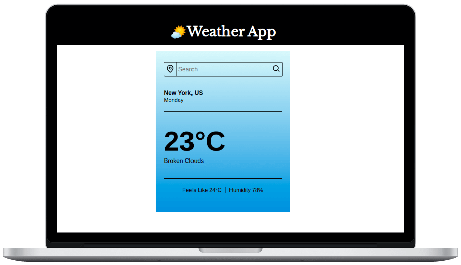

# Weather App



A weather app; that shows the current weather of a city. It changes the background to indicate different weather conditions. The app uses OpenWeatherMap API to fetch weather data. It can also show weather based on the user’s current location using Geolocation API.

:point_right: **See it live [here](https://sneharatnani.github.io/weather-app/)**

## Features

- Shows current weather data of a city.
- Displays weather data based on user's location.
- Changes the background to indicate different weather conditions.
- Shows extra information like humidity, feels like, description, dayName, city and country.
- Fully responsive design.

## Technologies Used

- JavaScript
- HTML
- CSS
- [webpack](https://webpack.js.org/)
- [OpenWeatherMap API](https://openweathermap.org/)
- [Geolocation API](https://developer.mozilla.org/en-US/docs/Web/API/Geolocation_API)
- [Jest](https://jestjs.io/)

## Getting Started

### Project Setup

```bash
# clone repo
git clone https://github.com/sneharatnani/weather-app.git

# changing directory
cd weather-app

# installing dependencies
npm install
```

### API Key Setup

- Get your API key from [OpenWeatherMap](https://openweathermap.org/)
- Rename .env.example to .env and provide your API Key.

### Run The Application

```bash
# starting server
npm start

# testing with Jest
npm run test
```

## License

Weather-app is [MIT licensed](./LICENSE).
